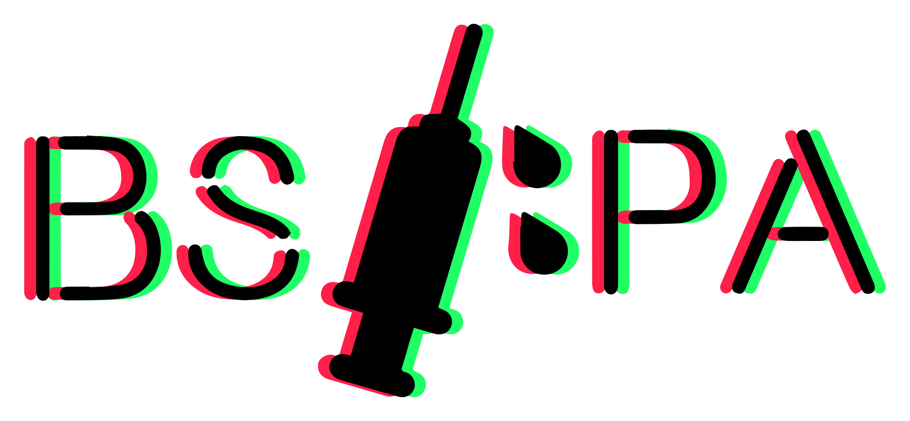

# 

# BSIPA Plus 

BSIPA+ is a fork of [BSIPA](https://github.com/nike4613/BeatSaber-IPA-Reloaded) that aims to fix some niche issues with BSIPA and add new features.

This project is currently in a very early stage, and is not ready for use yet.

## Documentation
You can find documentation for BSIPA+ [here](https://checksumdev.github.io/BSIPAPlus/).
