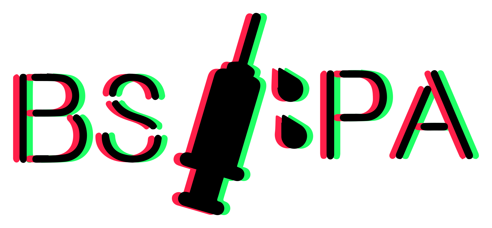

# 

BSIPA - The Unity mod injector for the new age (pending confirmation).

Assuming, that is, that Unity 2017 is "new age".

## How To Install

See [Installing](xref:articles.start.user)

## How To Uninstall

See [Uninstalling](xref:articles.start.user#uninstalling)

## Arguments

See <xref:articles.command_line>.

## How To Develop

See [Developing](xref:articles.start.dev) for more information.

## How To Keep The Game Patched

BSIPA will automatically repatch the game when it updates, as long as `winhttp.dll` is present in the install directory.
